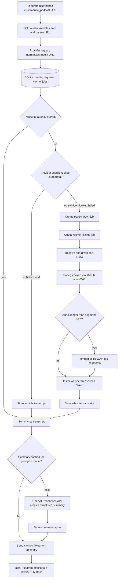

# Podcast Summarizer

Telegram bot that turns podcast/video URLs into Chinese investment-oriented summaries. It normalizes supported media URLs, reuses subtitles when available, falls back to faster-whisper transcription, summarizes through the OpenAI Responses API, caches results in SQLite, and sends rich Telegram summaries with language switch buttons.

Supported media sources:

- YouTube
- Xiaoyuzhou
- SoundOn

## Workflow



### Transcription defaults

The fallback transcription path uses `faster-whisper`.

Default settings:

| Setting | Environment variable | Default |
| --- | --- | --- |
| Whisper model | `WHISPER_MODEL` | `small` |
| Device | `WHISPER_DEVICE` | `cpu` |
| Compute type | `WHISPER_COMPUTE` | `int8` |
| Audio split size | `WHISPER_SEGMENT_SECONDS` | `300` seconds / 5 minutes |

Long audio is converted to 16 kHz mono WAV first. If the WAV duration is greater than `WHISPER_SEGMENT_SECONDS`, ffmpeg splits it into `part_000.wav`, `part_001.wav`, etc.; otherwise the single WAV is passed to faster-whisper. The same segment size is also passed to the faster-whisper helper.

## Configuration

Create a `.env` file from the example:

```sh
cp .env.example .env
```

Required values:

```dotenv
TELEGRAM_BOT_TOKEN=123456:telegram-token
BOT_OWNER_ID=123456789
OPENAI_API_KEY=sk-...
OPENAI_MODEL=gpt-4.1
```

Common optional values:

```dotenv
# OpenAI-compatible endpoint; defaults to OpenAI.
OPENAI_BASE_URL=https://api.openai.com/v1

# Default summary language for new requests: zh-hans or zh-hant.
DEFAULT_SUMMARY_VARIANT=zh-hans

# faster-whisper defaults.
WHISPER_MODEL=small
WHISPER_DEVICE=cpu
WHISPER_COMPUTE=int8
WHISPER_SEGMENT_SECONDS=300

# Extra yt-dlp args for current YouTube JS challenges.
YT_DLP_ARGS=--extractor-args youtube:player_client=android_vr --js-runtimes node --remote-components ejs:github
```

For Docker, leave `SQLITE_PATH` and `TEMP_ROOT` unset in `.env` unless you intentionally want to override the container defaults. `docker-compose.yml` sets:

- `SQLITE_PATH=/data/bot.db`
- `TEMP_ROOT=/tmp/podcast`

## Run with Docker Compose

Build and start the bot:

```sh
docker compose up -d --build
```

Follow logs:

```sh
docker compose logs -f podcast-summarizer
```

Stop the bot:

```sh
docker compose down
```

Stop and remove persistent data/model cache volumes:

```sh
docker compose down -v
```

Compose uses two named volumes:

- `podcast-data` mounted at `/data` for SQLite and app data.
- `podcast-model-cache` mounted at `/home/podcast/.cache/huggingface` so faster-whisper downloads the model once and reuses it across restarts.

The runtime image is CPU-only. It includes the Go bot binary, `yt-dlp`, `ffmpeg`, `python3`, `faster-whisper`, and `nodejs` for yt-dlp YouTube JS challenge handling.

## Bot commands

User commands:

```text
/summarize_podcast <MEDIA_URL>
/summary_status <MEDIA_URL>
/help
```

Owner commands:

```text
/subscribe_podcast <PODCAST_URL>
/unsubscribe_podcast <PODCAST_URL>
/subscriptions
/allow_group [CHAT_ID[,CHAT_ID...]]
/remove_group [CHAT_ID[,CHAT_ID...]]
/allow_user <USER_ID>
/remove_user <USER_ID>
/whitelist
```

`/summarize_podcast` may return immediately if a transcript and summary cache already exist. Otherwise it sends progress updates while downloading, splitting, transcribing, summarizing, and delivering the final rich Telegram summary.

## Crash recovery

The bot keeps durable state in SQLite, so Docker or process restarts do not lose queued work as long as the `podcast-data` volume is preserved.

On startup it recovers interrupted work before accepting new traffic:

- Transcription jobs left in `downloading_audio`, `converting_audio`, `splitting_audio`, or `transcribing` are moved back to `queued` when the media item still has no transcript.
- Summary requests left in `summarizing` are moved back to `pending_summary`.
- Summary requests left in `sending` become `delivery_unknown` because Telegram may or may not have received the final message before the crash.

While running, a recovery loop executes every minute:

- Summary requests stuck in `summarizing` for more than 10 minutes are requeued as `pending_summary`.
- Pending transcript requests without an active transcription job get a new `queued` transcription job.
- Media with pending summary requests is processed again, using cached transcripts and summaries when available.

Graceful shutdown is handled through SIGTERM/SIGINT. Docker Compose gives the container 30 seconds (`stop_grace_period: 30s`) to drain loops. If shutdown interrupts transcription, the worker requeues the job without incrementing the retry count. Non-cancellation transcription failures are retried up to two attempts by default.

Operational note: avoid `docker compose down -v` unless you intentionally want to delete recovery state. It removes the SQLite volume and the faster-whisper model cache.
